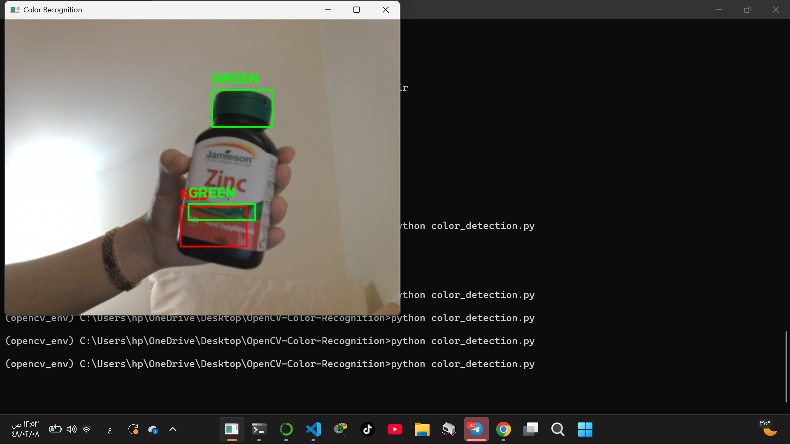
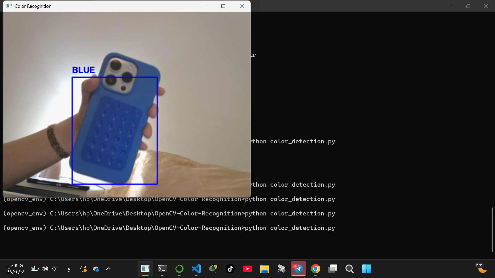

# OpenCV Color Recognition

## Project Description

This project uses OpenCV to detect three basic colors (Red, Green, and Blue) in real time using a webcam. When a colored object is detected, the program draws a bounding box around it and displays the color name on the screen.

## Features

- Detect Red objects.
- Detect Green objects.
- Detect Blue objects.
- Detect multiple colors at the same time.
- Draw a bounding box around detected objects.
- Display the detected color name.

## Requirements

- Python 3.11
- OpenCV
- NumPy
- Anaconda

## Installation

1. Install Anaconda.
2. Create a virtual environment:

```bash
conda create -n opencv_env python=3.11
```

3. Activate the environment:

```bash
conda activate opencv_env
```

4. Install the required libraries:

```bash
pip install -r requirements.txt
```

## Run the Project

Run the following command:

```bash
python color_detection.py
```

## Project Structure

```text
OpenCV-Color-Recognition/
│
├── color_detection.py
├── requirements.txt
├── screenshots/
│   ├── blue.png
│   └── red.Green.png
└── README.md
```

## Reminder

- Activate the Anaconda environment before running the project.
- Install the required libraries using `requirements.txt`.
- Run the program using `python color_detection.py`.
- Press **Q** to close the webcam window.

## Screenshots

### Red and Green Detection



### Blue Detection


